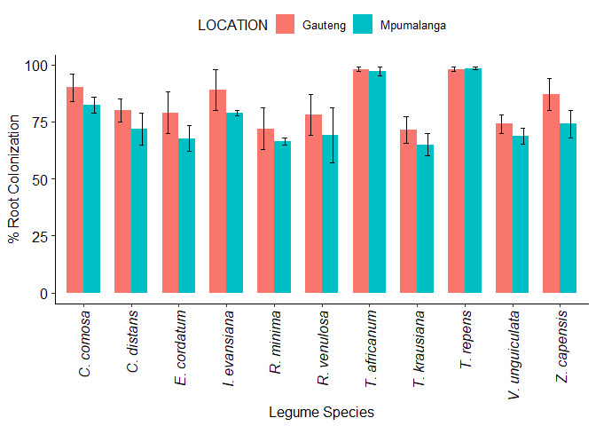
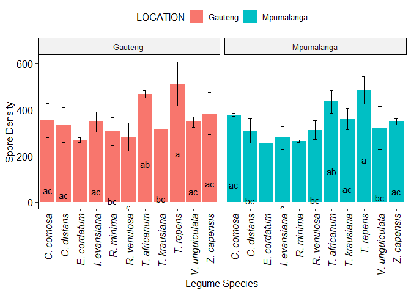
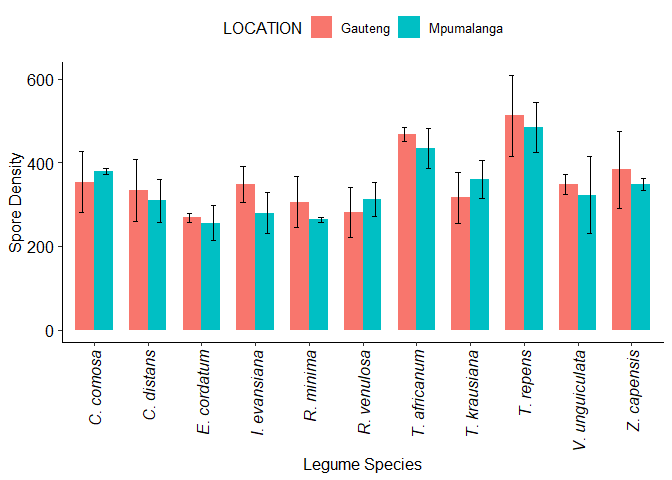

Legume Analysis
================
Chu Ngwoke
09/08/2021

This is an analysis of a dataset of variables (% colonization, Spore
density and soil properties) for 11 species of legumes in two different
provinces in South Africa - Guatent and Mpumalanga. Analysis is
conducted by Chu Ngwoke on this day 25th June, 2018. R version 4.0.0 is
used for this analysis.

### Reading the Dataset into R

``` r
Data1 <- read.table(file = "clipboard", sep = "\t", header = TRUE)
head(Data1)
```

    ##     SPECIES   LOCATION X.COLONIZATION SPORE_DENSITY   pH  NO3  NH4    P
    ## 1 C. comosa    Gauteng             90           387 5.40 8.24 1.35 1.10
    ## 2 C. comosa    Gauteng             84           270 5.25 8.36 1.37 1.20
    ## 3 C. comosa    Gauteng             96           404 5.55 8.19 1.32 1.11
    ## 4 C. comosa Mpumalanga             79           382 5.84 4.05 3.46 3.04
    ## 5 C. comosa Mpumalanga             82           383 5.49 4.45 3.48 3.09
    ## 6 C. comosa Mpumalanga             86           371 6.19 4.43 3.44 3.04
    ##   Organic_C      K   Cu    Mn   Zn   BD X.Sand X.Silt X.Clay
    ## 1      0.95  94.40 3.36 84.40 4.72 1.45   68.0     12      9
    ## 2      0.99  94.87 3.39 84.87 4.77 1.36   76.0     16     13
    ## 3      0.94  94.01 3.35 84.01 4.68 1.54   78.0     14     14
    ## 4      1.55 130.40 0.28 25.43 2.00 1.66   73.6      9     10
    ## 5      1.53 131.36 0.27 25.35 2.12 1.45   76.5     11     16
    ## 6      1.58 129.95 0.29 25.45 2.14 1.87   74.9     13     16

``` r
#loading required packages
library(plyr)
library(dplyr)
library(ggplot2)
```

    ## Warning: package 'ggplot2' was built under R version 4.0.3

``` r
library(ggpubr)
library(tidyr)
```

### Cleaning up the Data (row reduction)

Premliminary data cleaning was already done in excel (adding location
names to all 3 reading in each location and adding specie name to all 6
readings of every specie). To further clean the data, I will take the
average reading of variables in each location (average of 3 readings).

``` r
Data2 <- Data1 %>% group_by(SPECIES, LOCATION) %>% summarise_all(mean)
Data2 <- data.frame(Data2)
head(Data2)
```

    ##       SPECIES   LOCATION X.COLONIZATION SPORE_DENSITY       pH       NO3
    ## 1   C. comosa    Gauteng       90.00000      353.6667 5.400000  8.263333
    ## 2   C. comosa Mpumalanga       82.33333      378.6667 5.840000  4.310000
    ## 3  C. distans    Gauteng       80.00000      334.0000 5.480000  8.683333
    ## 4  C. distans Mpumalanga       71.66667      309.3333 5.610000  6.280000
    ## 5 E. cordatum    Gauteng       79.00000      269.0000 4.380000 16.110000
    ## 6 E. cordatum Mpumalanga       67.66667      255.3333 5.393333 11.110000
    ##         NH4        P Organic_C         K        Cu       Mn        Zn   BD
    ## 1  1.346667 1.136667  0.960000  94.42667 3.3666667 84.42667  4.723333 1.45
    ## 2  3.460000 3.056667  1.553333 130.57000 0.2800000 25.41000  2.086667 1.66
    ## 3  1.960000 3.333333  1.000000 130.27333 0.9733333 40.12667  3.933333 1.55
    ## 4  2.596667 4.450000  2.586667 163.35667 1.7733333 53.01000  6.113333 1.68
    ## 5  5.793333 4.766667  3.263333 175.27333 1.1766667 35.55000  8.576667 1.53
    ## 6 17.780000 2.016667  5.343333 232.95667 3.7300000 84.39333 13.420000 1.70
    ##   X.Sand X.Silt X.Clay
    ## 1     74     14     12
    ## 2     75     11     14
    ## 3     76     10     14
    ## 4     75     13     12
    ## 5     40     12     48
    ## 6     52     10     38

## Analysis

### 1\. Variation in % Colonization among species in each location.

To be able to attach error bars in the chart, I first calculate the
standard deviation from the means. The function below will take a
variable in the original dataset (before row reduction) and do the row
reduction and attach the standard deviations.

``` r
data_summary <- function(data, varname, groupnames){
  summary_func <- function(x, col){c(mean = mean(x[[col]], na.rm=TRUE), sd = sd(x[[col]], na.rm=TRUE))}
  data_sum<-ddply(data, groupnames, .fun=summary_func, varname)
  data_sum <- rename(data_sum, c("mean" = varname))
 return(data_sum)} 
```

Proceed to apply the fucntion to % Colonization

``` r
detach(package:dplyr)
coloni <- data_summary(data = Data1, varname = "X.COLONIZATION", groupnames = c("SPECIES", "LOCATION"))
coloni <- data.frame(coloni)
coloni$LOCATION <- as.factor(coloni$LOCATION)
head(coloni)
```

    ##       SPECIES   LOCATION X.COLONIZATION       sd
    ## 1   C. comosa    Gauteng       90.00000 6.000000
    ## 2   C. comosa Mpumalanga       82.33333 3.511885
    ## 3  C. distans    Gauteng       80.00000 5.000000
    ## 4  C. distans Mpumalanga       71.66667 7.023769
    ## 5 E. cordatum    Gauteng       79.00000 9.000000
    ## 6 E. cordatum Mpumalanga       67.66667 5.686241

``` r
library(data.table)

lett <- data.table(LETT = c("ab", "bc", "ab", "cd", "ab", "cd", "ab", "cd", "b", "d", "b", "cd", "a", "ab", "b", "d", "a", "a", "b", "cd", "ab", "cd" ))

coloni <- cbind(coloni, lett)
```

``` r
A <- aggregate(.~ LOCATION, data = Data2[ ,2:5], FUN = mean)

A
```

    ##     LOCATION X.COLONIZATION SPORE_DENSITY       pH
    ## 1    Gauteng       83.30303      356.4848 5.288485
    ## 2 Mpumalanga       76.24242      341.0606 5.174545

Plotting the chart

``` r
ggplot(coloni, aes(SPECIES, X.COLONIZATION, fill = LOCATION)) + geom_bar(stat = "identity") + facet_grid(. ~ LOCATION) + geom_errorbar(aes(ymin = X.COLONIZATION - sd, ymax = X.COLONIZATION + sd), width = .2, position = position_dodge(.9)) + ylab("% Root Colonization") + xlab("Legume Species") + theme_pubr() + theme(axis.text.x = element_text(angle = 90, vjust = 0.5, hjust=1, face = "italic")) + geom_text(aes(label = LETT), vjust= 10)
```

<!-- -->

The average (mean) value of % Colonization in Gauteng is `83.3030303`
and the mean value of % Colonization in Mpumalanga is `76.2424242`. I
proceed to test the significance of the variation of these mean values.

#### Comparing the Mean Values (Analysis of Variance)

``` r
library(dplyr)

Data3 <- Data2 %>% 
  select(LOCATION, X.COLONIZATION, SPORE_DENSITY) %>% 
  gather(key = variable, value = value, -LOCATION) %>% 
  group_by(LOCATION, variable) %>% 
  summarise(value = list(value)) %>% 
  spread(LOCATION, value) %>% 
  group_by(variable) 
```

First, I test to see if the distributions are normally distributed. This
is done with **Shapiro-wilk normality test** with a significance level
set at 0.05.

Null hypothesis: the data are normally distributed

Alternative hypothesis: the data are not normally distributed

``` r
with(Data2, shapiro.test(X.COLONIZATION))
```

    ## 
    ##  Shapiro-Wilk normality test
    ## 
    ## data:  X.COLONIZATION
    ## W = 0.90513, p-value = 0.03769

``` r
with(Data2, shapiro.test(SPORE_DENSITY))
```

    ## 
    ##  Shapiro-Wilk normality test
    ## 
    ## data:  SPORE_DENSITY
    ## W = 0.9122, p-value = 0.05251

The distribution of %colonization returns a p-value of 0.03769, which is
less than the significance level of 0.05, we reject the null hypothesis,
Hence, % colonization is not normally distributed. We therefore compare
the means with **unpaired two sample wilcoxon rank rest.**

Note that the distribution of Spore density returns a p-value of
0.05251, which is greater than the significance level of 0.05, we accept
the null hypothesis, this means that spore density is normally
distributed, hence we will compate the means with **unpaired two- sample
t-test**

**Wilcoxon rank test**

we carryout this test on the mean values of %colonization in Gauteng and
Mpumalanga. Significance level is set at 0.05

Null hypothesis: the difference in mean is not statistically significant

Alternative hypothesis: the difference in mean is statistically
significant

``` r
Data3 %>% mutate(p_value = wilcox.test(unlist(Gauteng), unlist(Mpumalanga), exact = FALSE)$p.value)
```

    ## # A tibble: 2 x 4
    ## # Groups:   variable [2]
    ##   variable       Gauteng    Mpumalanga p_value
    ##   <chr>          <list>     <list>       <dbl>
    ## 1 SPORE_DENSITY  <dbl [11]> <dbl [11]>  0.646 
    ## 2 X.COLONIZATION <dbl [11]> <dbl [11]>  0.0817

the test returns a p-value of 0.0817, which is greater than the
significance level of 0.05, **we therefore accept the null hypothesis
and conclude that the mean value of %colonization in Gauteng is not
significantly different than in Mpumalanga**

## 2\. Variation in % Colonization of Species between Locations.

I will use joined bar chart to visualize this.

``` r
p <- ggplot(coloni, aes(SPECIES, X.COLONIZATION, fill = LOCATION, width = .7 ))
p + geom_bar(stat = "identity", position = position_dodge()) + geom_errorbar(aes(ymin = X.COLONIZATION - sd, ymax = X.COLONIZATION + sd), width = .2, position = position_dodge(.9)) + ylab("% Root Colonization") + xlab("Legume Species") + theme_pubr() + theme(axis.text.x = element_text(angle = 90, vjust = 0.5, hjust=1, face = "italic"))
```

<!-- -->

We proceed to compare the mean values of % colonization of each specie
between the 2 locations

#### Comparing mean values

The comparison will be done with unpaired two sample t-test. This
assumes normality of the data.

**Unpaired two-sample t-test**

The significance level is set at 0.05

Null hypothesis: The difference in mean values is not statisitcally
signifcant

Alternative hypothesis: The difference in mean values is statistically
significant

``` r
compare1 <- Data1 %>% group_by(SPECIES) %>% summarise(across(where(is.numeric), ~ t.test(.[LOCATION == 'Gauteng'], .[LOCATION == 'Mpumalanga'])$p.value))

compare1 %>% select(SPECIES, X.COLONIZATION)
```

    ## # A tibble: 11 x 2
    ##    SPECIES        X.COLONIZATION
    ##    <chr>                   <dbl>
    ##  1 C. comosa              0.146 
    ##  2 C. distans             0.177 
    ##  3 E. cordatum            0.152 
    ##  4 I. evansiana           0.183 
    ##  5 R. minima              0.390 
    ##  6 R. venulosa            0.362 
    ##  7 T. africanum           0.496 
    ##  8 T. krausiana           0.229 
    ##  9 T. repens              0.649 
    ## 10 V. unguiculata         0.159 
    ## 11 Z. capensis            0.0725

The values in the `X.COLONIZATION` column of the table above shows the
p-value of the t.test of each specie’s %colonization between the 2
locations. All the p-values are **greater than** 0.05, thus we accept
the null hypothesis. **We therefore conclude that FOR ALL THE SPECIES,
the difference in the mean value of % colonization in Gauteng and
Mpumalanga is not statistically significant.**

## 3\. Variation in Spore Density among Species in each Location

As in section 1, we first calculate the standard deviations to be able
to attach error bars to our plot. I will apply the function defined in
section 1 to Spore density column of the orginal dataset to calculate
the standard deviations from the mean.

``` r
detach(package:dplyr)
spore_d <- data_summary(data = Data1, varname = "SPORE_DENSITY", groupnames = c("SPECIES", "LOCATION"))
spore_d <- data.frame(spore_d)
spore_d$LOCATION <- as.factor(spore_d$LOCATION)
head(spore_d)
```

    ##       SPECIES   LOCATION SPORE_DENSITY        sd
    ## 1   C. comosa    Gauteng      353.6667 72.954324
    ## 2   C. comosa Mpumalanga      378.6667  6.658328
    ## 3  C. distans    Gauteng      334.0000 75.000000
    ## 4  C. distans Mpumalanga      309.3333 52.041650
    ## 5 E. cordatum    Gauteng      269.0000 11.000000
    ## 6 E. cordatum Mpumalanga      255.3333 41.633320

``` r
lett2 <- data.table(LETT = c("ac", "ac", "ac", "bc", "c", "c", "ac", "c", "bc", "c", "c", "bc", "ab", "ab", "bc", "ac", "a", "a", "ac", "bc", "ac", "ac" ))

spore_d <- cbind(spore_d, lett2)
```

Plotting the chart

``` r
ggplot(spore_d, aes(SPECIES, SPORE_DENSITY, fill = LOCATION)) + geom_bar(stat = "identity") + facet_grid(. ~ LOCATION) + geom_errorbar(aes(ymin = SPORE_DENSITY - sd, ymax = SPORE_DENSITY + sd), width = .2, position = position_dodge(.9)) + ylab("Spore Density") + xlab("Legume Species") + theme_pubr() + theme(axis.text.x = element_text(angle = 90, vjust = 0.5, hjust=1, face = "italic")) + geom_text(aes(label = LETT), vjust= 10)
```

<!-- -->

The average (mean) value of Spore Density in Gauteng is `356.4848485`
and the mean value of Spore Density in Mpumalanga is `341.0606061`. I
proceed to test the significance of the variation of these mean values.

#### Comparing the Mean Values (Analysis of Variance)

As stated in section 1, shapiro test on the distribution of spore
density show that it follows a normal distribution. hence, we will
compare the mean values using an unpaired two-sample t-test.

**Unpaired two-sample t-test**

The significance level is set at 0.05

Null hypothesis: The difference in mean values is not statisitcally
signifcant

Alternative hypothesis: The difference in mean values is statistically
significant

``` r
Data3 %>% mutate(p_value = t.test(unlist(Gauteng), unlist(Mpumalanga))$p.value)
```

    ## # A tibble: 2 x 4
    ## # Groups:   variable [2]
    ##   variable       Gauteng    Mpumalanga p_value
    ##   <chr>          <list>     <list>       <dbl>
    ## 1 SPORE_DENSITY  <dbl [11]> <dbl [11]>   0.625
    ## 2 X.COLONIZATION <dbl [11]> <dbl [11]>   0.142

the test returns a p-value of 0.625, which is greater than the
significance level of 0.05, **we therefore accept the null hypothesis
and conclude that the mean value of spore density in Gauteng is not
significantly different than in Mpumalanga**

## 4\. Variation in % Colonization of Species between Locations.

I will use joined bar chart to visualize this.

``` r
p <- ggplot(spore_d, aes(SPECIES, SPORE_DENSITY, fill = LOCATION, width = .7 ))
p + geom_bar(stat = "identity", position = position_dodge()) + geom_errorbar(aes(ymin = SPORE_DENSITY - sd, ymax = SPORE_DENSITY + sd), width = .2, position = position_dodge(.9)) + ylab("Spore Density") + xlab("Legume Species") + theme_pubr() + theme(axis.text.x = element_text(angle = 90, vjust = 0.5, hjust=1, face = "italic"))
```

<!-- -->

We proceed to compare the mean values of spore density of each specie
between the 2 locations

#### Comparing mean values

The comparison will be done with unpaired two sample t-test. This
assumes normality of the data.

**Unpaired two-sample t-test**

The significance level is set at 0.05

Null hypothesis: The difference in mean values is not statisitcally
signifcant

Alternative hypothesis: The difference in mean values is statistically
significant

``` r
library(dplyr)
```

``` r
compare1 <- Data1 %>% group_by(SPECIES) %>% summarise(across(where(is.numeric), ~ t.test(.[LOCATION == 'Gauteng'], .[LOCATION == 'Mpumalanga'])$p.value))

compare1 %>% select(SPECIES, SPORE_DENSITY)
```

    ## # A tibble: 11 x 2
    ##    SPECIES        SPORE_DENSITY
    ##    <chr>                  <dbl>
    ##  1 C. comosa              0.614
    ##  2 C. distans             0.667
    ##  3 E. cordatum            0.632
    ##  4 I. evansiana           0.145
    ##  5 R. minima              0.350
    ##  6 R. venulosa            0.508
    ##  7 T. africanum           0.358
    ##  8 T. krausiana           0.379
    ##  9 T. repens              0.704
    ## 10 V. unguiculata         0.689
    ## 11 Z. capensis            0.579

The values in the `SPORE_DENSITY` column of the table above shows the
p-value of the t.test of each specie’s spore density between the 2
locations. All the p-values are **greater than** 0.05, thus we accept
the null hypothesis. **We therefore conclude that FOR ALL THE SPECIES,
the difference in the mean value of spore density in Gauteng and
Mpumalanga is not statistically significant.**

## One-Way ANOVA to compare the %Colonization among the legumes in Gauteng

Significance level p = 0.05

**Null hypothesis:** the means of the different groups are the same

**Alternative hypothesis:** At least one cultivar’s mean is not equal to
the others.

First, I extract the relevant data from the orginal dataset.

``` r
library(dplyr)
data <- Data1 %>% select(SPECIES, LOCATION, X.COLONIZATION) %>% filter(LOCATION == "Gauteng")
data$SPECIES <- as.factor(data$SPECIES)
head(data)
```

    ##      SPECIES LOCATION X.COLONIZATION
    ## 1  C. comosa  Gauteng             90
    ## 2  C. comosa  Gauteng             84
    ## 3  C. comosa  Gauteng             96
    ## 4 C. distans  Gauteng             80
    ## 5 C. distans  Gauteng             75
    ## 6 C. distans  Gauteng             85

``` r
library(openxlsx)
write.xlsx(data, 'sample2.xlsx')

# I also extract the data for the mpumalanga (and for spore density)
data7 <- Data1 %>% select(SPECIES, LOCATION, X.COLONIZATION) %>% filter(LOCATION == "Mpumalanga")
data7$SPECIES <- as.factor(data7$SPECIES)

data5 <- Data1 %>% select(SPECIES, LOCATION, SPORE_DENSITY) %>% filter(LOCATION == "Gauteng")
data5$SPECIES <- as.factor(data5$SPECIES)

data6 <- Data1 %>% select(SPECIES, LOCATION, SPORE_DENSITY) %>% filter(LOCATION == "Mpumalanga")
data6$SPECIES <- as.factor(data6$SPECIES)
```

carrying out one-way ANOVA on the extracted data

``` r
res.aov <- aov(X.COLONIZATION ~ SPECIES, data = data)
summary(res.aov)
```

    ##             Df Sum Sq Mean Sq F value  Pr(>F)    
    ## SPECIES     10 2814.3  281.43   6.365 0.00015 ***
    ## Residuals   22  972.7   44.21                    
    ## ---
    ## Signif. codes:  0 '***' 0.001 '**' 0.01 '*' 0.05 '.' 0.1 ' ' 1

The ANOVA test returns a p-value of **0.00015**. As the p-value is less
than the significance level 0.05, we can conclude that there are
significant differences between the groups highlighted with “\*" in the
model summary.

**NOTE:** In one-way ANOVA test, a significant p-value indicates that
some of the group means are different, but we don’t know which pairs of
groups are different.

We therefore perform multiple pairwise-comparison, to determine if the
mean difference between specific pairs of group are statistically
significant.

we can compute **Tukey HSD (Tukey Honest Significant Differences)** for
performing multiple pairwise-comparison between the means of groups.

``` r
#TukeyHSD(res.aov)

library(multcomp)
summary(glht(res.aov, linfct = mcp(SPECIES = "Tukey")))
```

    ## 
    ##   Simultaneous Tests for General Linear Hypotheses
    ## 
    ## Multiple Comparisons of Means: Tukey Contrasts
    ## 
    ## 
    ## Fit: aov(formula = X.COLONIZATION ~ SPECIES, data = data)
    ## 
    ## Linear Hypotheses:
    ##                                      Estimate Std. Error t value Pr(>|t|)   
    ## C. distans - C. comosa == 0        -1.000e+01  5.429e+00  -1.842   0.7449   
    ## E. cordatum - C. comosa == 0       -1.100e+01  5.429e+00  -2.026   0.6345   
    ## I. evansiana - C. comosa == 0      -1.000e+00  5.429e+00  -0.184   1.0000   
    ## R. minima - C. comosa == 0         -1.800e+01  5.429e+00  -3.315   0.0849 . 
    ## R. venulosa - C. comosa == 0       -1.200e+01  5.429e+00  -2.210   0.5208   
    ## T. africanum - C. comosa == 0       8.000e+00  5.429e+00   1.474   0.9138   
    ## T. krausiana - C. comosa == 0      -1.867e+01  5.429e+00  -3.438   0.0663 . 
    ## T. repens - C. comosa == 0          8.000e+00  5.429e+00   1.474   0.9137   
    ## V. unguiculata - C. comosa == 0    -1.600e+01  5.429e+00  -2.947   0.1701   
    ## Z. capensis - C. comosa == 0       -3.000e+00  5.429e+00  -0.553   1.0000   
    ## E. cordatum - C. distans == 0      -1.000e+00  5.429e+00  -0.184   1.0000   
    ## I. evansiana - C. distans == 0      9.000e+00  5.429e+00   1.658   0.8405   
    ## R. minima - C. distans == 0        -8.000e+00  5.429e+00  -1.474   0.9137   
    ## R. venulosa - C. distans == 0      -2.000e+00  5.429e+00  -0.368   1.0000   
    ## T. africanum - C. distans == 0      1.800e+01  5.429e+00   3.315   0.0855 . 
    ## T. krausiana - C. distans == 0     -8.667e+00  5.429e+00  -1.596   0.8679   
    ## T. repens - C. distans == 0         1.800e+01  5.429e+00   3.315   0.0854 . 
    ## V. unguiculata - C. distans == 0   -6.000e+00  5.429e+00  -1.105   0.9864   
    ## Z. capensis - C. distans == 0       7.000e+00  5.429e+00   1.289   0.9613   
    ## I. evansiana - E. cordatum == 0     1.000e+01  5.429e+00   1.842   0.7449   
    ## R. minima - E. cordatum == 0       -7.000e+00  5.429e+00  -1.289   0.9612   
    ## R. venulosa - E. cordatum == 0     -1.000e+00  5.429e+00  -0.184   1.0000   
    ## T. africanum - E. cordatum == 0     1.900e+01  5.429e+00   3.500   0.0584 . 
    ## T. krausiana - E. cordatum == 0    -7.667e+00  5.429e+00  -1.412   0.9323   
    ## T. repens - E. cordatum == 0        1.900e+01  5.429e+00   3.500   0.0581 . 
    ## V. unguiculata - E. cordatum == 0  -5.000e+00  5.429e+00  -0.921   0.9966   
    ## Z. capensis - E. cordatum == 0      8.000e+00  5.429e+00   1.474   0.9135   
    ## R. minima - I. evansiana == 0      -1.700e+01  5.429e+00  -3.131   0.1213   
    ## R. venulosa - I. evansiana == 0    -1.100e+01  5.429e+00  -2.026   0.6348   
    ## T. africanum - I. evansiana == 0    9.000e+00  5.429e+00   1.658   0.8404   
    ## T. krausiana - I. evansiana == 0   -1.767e+01  5.429e+00  -3.254   0.0958 . 
    ## T. repens - I. evansiana == 0       9.000e+00  5.429e+00   1.658   0.8407   
    ## V. unguiculata - I. evansiana == 0 -1.500e+01  5.429e+00  -2.763   0.2355   
    ## Z. capensis - I. evansiana == 0    -2.000e+00  5.429e+00  -0.368   1.0000   
    ## R. venulosa - R. minima == 0        6.000e+00  5.429e+00   1.105   0.9863   
    ## T. africanum - R. minima == 0       2.600e+01  5.429e+00   4.789    <0.01 **
    ## T. krausiana - R. minima == 0      -6.667e-01  5.429e+00  -0.123   1.0000   
    ## T. repens - R. minima == 0          2.600e+01  5.429e+00   4.789    <0.01 **
    ## V. unguiculata - R. minima == 0     2.000e+00  5.429e+00   0.368   1.0000   
    ## Z. capensis - R. minima == 0        1.500e+01  5.429e+00   2.763   0.2358   
    ## T. africanum - R. venulosa == 0     2.000e+01  5.429e+00   3.684   0.0401 * 
    ## T. krausiana - R. venulosa == 0    -6.667e+00  5.429e+00  -1.228   0.9717   
    ## T. repens - R. venulosa == 0        2.000e+01  5.429e+00   3.684   0.0399 * 
    ## V. unguiculata - R. venulosa == 0  -4.000e+00  5.429e+00  -0.737   0.9995   
    ## Z. capensis - R. venulosa == 0      9.000e+00  5.429e+00   1.658   0.8405   
    ## T. krausiana - T. africanum == 0   -2.667e+01  5.429e+00  -4.912    <0.01 **
    ## T. repens - T. africanum == 0       7.105e-15  5.429e+00   0.000   1.0000   
    ## V. unguiculata - T. africanum == 0 -2.400e+01  5.429e+00  -4.421    <0.01 **
    ## Z. capensis - T. africanum == 0    -1.100e+01  5.429e+00  -2.026   0.6351   
    ## T. repens - T. krausiana == 0       2.667e+01  5.429e+00   4.912    <0.01 **
    ## V. unguiculata - T. krausiana == 0  2.667e+00  5.429e+00   0.491   1.0000   
    ## Z. capensis - T. krausiana == 0     1.567e+01  5.429e+00   2.886   0.1908   
    ## V. unguiculata - T. repens == 0    -2.400e+01  5.429e+00  -4.421    <0.01 **
    ## Z. capensis - T. repens == 0       -1.100e+01  5.429e+00  -2.026   0.6351   
    ## Z. capensis - V. unguiculata == 0   1.300e+01  5.429e+00   2.395   0.4118   
    ## ---
    ## Signif. codes:  0 '***' 0.001 '**' 0.01 '*' 0.05 '.' 0.1 ' ' 1
    ## (Adjusted p values reported -- single-step method)

**The pairs of legumes marked asteriks in the result of the Tukey HSD
are significantly different**

## One-Way ANOVA to compare the %Colonization among the legumes in Mpumalanga

Significance level p = 0.05

**Null hypothesis:** the means of the different groups are the same

**Alternative hypothesis:** At least one cultivar’s mean is not equal to
the others.

``` r
res.aov2 <- aov(X.COLONIZATION ~ SPECIES, data = data7)
summary(res.aov2)
```

    ##             Df Sum Sq Mean Sq F value   Pr(>F)    
    ## SPECIES     10   4187   418.7   14.42 1.78e-07 ***
    ## Residuals   22    639    29.0                     
    ## ---
    ## Signif. codes:  0 '***' 0.001 '**' 0.01 '*' 0.05 '.' 0.1 ' ' 1

The ANOVA test returns a very low p-value. As the p-value is less than
the significance level 0.05, we can conclude that there are significant
differences between the groups highlighted with “\*" in the model
summary.

Just like in the analysis above, we can compute **Tukey HSD (Tukey
Honest Significant Differences)** for performing multiple
pairwise-comparison between the means of groups.

``` r
#TukeyHSD(res.aov2)

#library(multcomp)
summary(glht(res.aov2, linfct = mcp(SPECIES = "Tukey")))
```

    ## 
    ##   Simultaneous Tests for General Linear Hypotheses
    ## 
    ## Multiple Comparisons of Means: Tukey Contrasts
    ## 
    ## 
    ## Fit: aov(formula = X.COLONIZATION ~ SPECIES, data = data7)
    ## 
    ## Linear Hypotheses:
    ##                                    Estimate Std. Error t value Pr(>|t|)    
    ## C. distans - C. comosa == 0        -10.6667     4.3993  -2.425   0.3949    
    ## E. cordatum - C. comosa == 0       -14.6667     4.3993  -3.334   0.0819 .  
    ## I. evansiana - C. comosa == 0       -3.6667     4.3993  -0.833   0.9985    
    ## R. minima - C. comosa == 0         -16.0000     4.3993  -3.637   0.0438 *  
    ## R. venulosa - C. comosa == 0       -13.3333     4.3993  -3.031   0.1468    
    ## T. africanum - C. comosa == 0       14.6667     4.3993   3.334   0.0819 .  
    ## T. krausiana - C. comosa == 0      -17.3333     4.3993  -3.940   0.0230 *  
    ## T. repens - C. comosa == 0          16.0000     4.3993   3.637   0.0441 *  
    ## V. unguiculata - C. comosa == 0    -13.6667     4.3993  -3.107   0.1282    
    ## Z. capensis - C. comosa == 0        -8.3333     4.3993  -1.894   0.7147    
    ## E. cordatum - C. distans == 0       -4.0000     4.3993  -0.909   0.9969    
    ## I. evansiana - C. distans == 0       7.0000     4.3993   1.591   0.8698    
    ## R. minima - C. distans == 0         -5.3333     4.3993  -1.212   0.9741    
    ## R. venulosa - C. distans == 0       -2.6667     4.3993  -0.606   0.9999    
    ## T. africanum - C. distans == 0      25.3333     4.3993   5.759    <0.01 ***
    ## T. krausiana - C. distans == 0      -6.6667     4.3993  -1.515   0.8996    
    ## T. repens - C. distans == 0         26.6667     4.3993   6.062    <0.01 ***
    ## V. unguiculata - C. distans == 0    -3.0000     4.3993  -0.682   0.9997    
    ## Z. capensis - C. distans == 0        2.3333     4.3993   0.530   1.0000    
    ## I. evansiana - E. cordatum == 0     11.0000     4.3993   2.500   0.3545    
    ## R. minima - E. cordatum == 0        -1.3333     4.3993  -0.303   1.0000    
    ## R. venulosa - E. cordatum == 0       1.3333     4.3993   0.303   1.0000    
    ## T. africanum - E. cordatum == 0     29.3333     4.3993   6.668    <0.01 ***
    ## T. krausiana - E. cordatum == 0     -2.6667     4.3993  -0.606   0.9999    
    ## T. repens - E. cordatum == 0        30.6667     4.3993   6.971    <0.01 ***
    ## V. unguiculata - E. cordatum == 0    1.0000     4.3993   0.227   1.0000    
    ## Z. capensis - E. cordatum == 0       6.3333     4.3993   1.440   0.9245    
    ## R. minima - I. evansiana == 0      -12.3333     4.3993  -2.803   0.2193    
    ## R. venulosa - I. evansiana == 0     -9.6667     4.3993  -2.197   0.5288    
    ## T. africanum - I. evansiana == 0    18.3333     4.3993   4.167   0.0137 *  
    ## T. krausiana - I. evansiana == 0   -13.6667     4.3993  -3.107   0.1277    
    ## T. repens - I. evansiana == 0       19.6667     4.3993   4.470    <0.01 ** 
    ## V. unguiculata - I. evansiana == 0 -10.0000     4.3993  -2.273   0.4819    
    ## Z. capensis - I. evansiana == 0     -4.6667     4.3993  -1.061   0.9899    
    ## R. venulosa - R. minima == 0         2.6667     4.3993   0.606   0.9999    
    ## T. africanum - R. minima == 0       30.6667     4.3993   6.971    <0.01 ***
    ## T. krausiana - R. minima == 0       -1.3333     4.3993  -0.303   1.0000    
    ## T. repens - R. minima == 0          32.0000     4.3993   7.274    <0.01 ***
    ## V. unguiculata - R. minima == 0      2.3333     4.3993   0.530   1.0000    
    ## Z. capensis - R. minima == 0         7.6667     4.3993   1.743   0.7988    
    ## T. africanum - R. venulosa == 0     28.0000     4.3993   6.365    <0.01 ***
    ## T. krausiana - R. venulosa == 0     -4.0000     4.3993  -0.909   0.9969    
    ## T. repens - R. venulosa == 0        29.3333     4.3993   6.668    <0.01 ***
    ## V. unguiculata - R. venulosa == 0   -0.3333     4.3993  -0.076   1.0000    
    ## Z. capensis - R. venulosa == 0       5.0000     4.3993   1.137   0.9834    
    ## T. krausiana - T. africanum == 0   -32.0000     4.3993  -7.274    <0.01 ***
    ## T. repens - T. africanum == 0        1.3333     4.3993   0.303   1.0000    
    ## V. unguiculata - T. africanum == 0 -28.3333     4.3993  -6.440    <0.01 ***
    ## Z. capensis - T. africanum == 0    -23.0000     4.3993  -5.228    <0.01 ** 
    ## T. repens - T. krausiana == 0       33.3333     4.3993   7.577    <0.01 ***
    ## V. unguiculata - T. krausiana == 0   3.6667     4.3993   0.833   0.9985    
    ## Z. capensis - T. krausiana == 0      9.0000     4.3993   2.046   0.6221    
    ## V. unguiculata - T. repens == 0    -29.6667     4.3993  -6.744    <0.01 ***
    ## Z. capensis - T. repens == 0       -24.3333     4.3993  -5.531    <0.01 ***
    ## Z. capensis - V. unguiculata == 0    5.3333     4.3993   1.212   0.9741    
    ## ---
    ## Signif. codes:  0 '***' 0.001 '**' 0.01 '*' 0.05 '.' 0.1 ' ' 1
    ## (Adjusted p values reported -- single-step method)

**The pairs of legumes marked asteriks (triple asteriks shows more
difference) in the result of the Tukey HSD are significantly different**

## One-Way ANOVA to compare the Spore Density among the legumes in Gauteng

Significance level p = 0.05

**Null hypothesis:** the means of the different groups are the same

**Alternative hypothesis:** At least one cultivar’s mean is not equal to
the others.

``` r
res.aov3 <- aov(SPORE_DENSITY ~ SPECIES, data = data5)
summary(res.aov3)
```

    ##             Df Sum Sq Mean Sq F value  Pr(>F)   
    ## SPECIES     10 166553   16655   4.296 0.00209 **
    ## Residuals   22  85289    3877                   
    ## ---
    ## Signif. codes:  0 '***' 0.001 '**' 0.01 '*' 0.05 '.' 0.1 ' ' 1

The ANOVA test returns a p-value of **0.00209**. As the p-value is less
than the significance level 0.05, we can conclude that there are
significant differences between the groups highlighted with “\*" in the
model summary.

we can compute **Tukey HSD (Tukey Honest Significant Differences)** for
performing multiple pairwise-comparison between the means of groups.

``` r
#TukeyHSD(res.aov3)
#library(multcomp)
summary(glht(res.aov3, linfct = mcp(SPECIES = "Tukey")))
```

    ## 
    ##   Simultaneous Tests for General Linear Hypotheses
    ## 
    ## Multiple Comparisons of Means: Tukey Contrasts
    ## 
    ## 
    ## Fit: aov(formula = SPORE_DENSITY ~ SPECIES, data = data5)
    ## 
    ## Linear Hypotheses:
    ##                                      Estimate Std. Error t value Pr(>|t|)   
    ## C. distans - C. comosa == 0        -1.967e+01  5.084e+01  -0.387   1.0000   
    ## E. cordatum - C. comosa == 0       -8.467e+01  5.084e+01  -1.665   0.8369   
    ## I. evansiana - C. comosa == 0      -5.667e+00  5.084e+01  -0.111   1.0000   
    ## R. minima - C. comosa == 0         -4.733e+01  5.084e+01  -0.931   0.9963   
    ## R. venulosa - C. comosa == 0       -7.200e+01  5.084e+01  -1.416   0.9310   
    ## T. africanum - C. comosa == 0       1.143e+02  5.084e+01   2.249   0.4975   
    ## T. krausiana - C. comosa == 0      -3.733e+01  5.084e+01  -0.734   0.9995   
    ## T. repens - C. comosa == 0          1.587e+02  5.084e+01   3.121   0.1238   
    ## V. unguiculata - C. comosa == 0    -5.667e+00  5.084e+01  -0.111   1.0000   
    ## Z. capensis - C. comosa == 0        3.033e+01  5.084e+01   0.597   0.9999   
    ## E. cordatum - C. distans == 0      -6.500e+01  5.084e+01  -1.279   0.9633   
    ## I. evansiana - C. distans == 0      1.400e+01  5.084e+01   0.275   1.0000   
    ## R. minima - C. distans == 0        -2.767e+01  5.084e+01  -0.544   1.0000   
    ## R. venulosa - C. distans == 0      -5.233e+01  5.084e+01  -1.029   0.9919   
    ## T. africanum - C. distans == 0      1.340e+02  5.084e+01   2.636   0.2892   
    ## T. krausiana - C. distans == 0     -1.767e+01  5.084e+01  -0.348   1.0000   
    ## T. repens - C. distans == 0         1.783e+02  5.084e+01   3.508   0.0575 . 
    ## V. unguiculata - C. distans == 0    1.400e+01  5.084e+01   0.275   1.0000   
    ## Z. capensis - C. distans == 0       5.000e+01  5.084e+01   0.984   0.9943   
    ## I. evansiana - E. cordatum == 0     7.900e+01  5.084e+01   1.554   0.8848   
    ## R. minima - E. cordatum == 0        3.733e+01  5.084e+01   0.734   0.9995   
    ## R. venulosa - E. cordatum == 0      1.267e+01  5.084e+01   0.249   1.0000   
    ## T. africanum - E. cordatum == 0     1.990e+02  5.084e+01   3.914   0.0238 * 
    ## T. krausiana - E. cordatum == 0     4.733e+01  5.084e+01   0.931   0.9963   
    ## T. repens - E. cordatum == 0        2.433e+02  5.084e+01   4.786    <0.01 **
    ## V. unguiculata - E. cordatum == 0   7.900e+01  5.084e+01   1.554   0.8851   
    ## Z. capensis - E. cordatum == 0      1.150e+02  5.084e+01   2.262   0.4890   
    ## R. minima - I. evansiana == 0      -4.167e+01  5.084e+01  -0.820   0.9987   
    ## R. venulosa - I. evansiana == 0    -6.633e+01  5.084e+01  -1.305   0.9582   
    ## T. africanum - I. evansiana == 0    1.200e+02  5.084e+01   2.360   0.4310   
    ## T. krausiana - I. evansiana == 0   -3.167e+01  5.084e+01  -0.623   0.9999   
    ## T. repens - I. evansiana == 0       1.643e+02  5.084e+01   3.232   0.1001   
    ## V. unguiculata - I. evansiana == 0  3.464e-14  5.084e+01   0.000   1.0000   
    ## Z. capensis - I. evansiana == 0     3.600e+01  5.084e+01   0.708   0.9996   
    ## R. venulosa - R. minima == 0       -2.467e+01  5.084e+01  -0.485   1.0000   
    ## T. africanum - R. minima == 0       1.617e+02  5.084e+01   3.180   0.1111   
    ## T. krausiana - R. minima == 0       1.000e+01  5.084e+01   0.197   1.0000   
    ## T. repens - R. minima == 0          2.060e+02  5.084e+01   4.052   0.0181 * 
    ## V. unguiculata - R. minima == 0     4.167e+01  5.084e+01   0.820   0.9987   
    ## Z. capensis - R. minima == 0        7.767e+01  5.084e+01   1.528   0.8949   
    ## T. africanum - R. venulosa == 0     1.863e+02  5.084e+01   3.665   0.0412 * 
    ## T. krausiana - R. venulosa == 0     3.467e+01  5.084e+01   0.682   0.9997   
    ## T. repens - R. venulosa == 0        2.307e+02  5.084e+01   4.537    <0.01 **
    ## V. unguiculata - R. venulosa == 0   6.633e+01  5.084e+01   1.305   0.9581   
    ## Z. capensis - R. venulosa == 0      1.023e+02  5.084e+01   2.013   0.6427   
    ## T. krausiana - T. africanum == 0   -1.517e+02  5.084e+01  -2.983   0.1603   
    ## T. repens - T. africanum == 0       4.433e+01  5.084e+01   0.872   0.9978   
    ## V. unguiculata - T. africanum == 0 -1.200e+02  5.084e+01  -2.360   0.4311   
    ## Z. capensis - T. africanum == 0    -8.400e+01  5.084e+01  -1.652   0.8432   
    ## T. repens - T. krausiana == 0       1.960e+02  5.084e+01   3.855   0.0277 * 
    ## V. unguiculata - T. krausiana == 0  3.167e+01  5.084e+01   0.623   0.9999   
    ## Z. capensis - T. krausiana == 0     6.767e+01  5.084e+01   1.331   0.9526   
    ## V. unguiculata - T. repens == 0    -1.643e+02  5.084e+01  -3.232   0.0996 . 
    ## Z. capensis - T. repens == 0       -1.283e+02  5.084e+01  -2.524   0.3427   
    ## Z. capensis - V. unguiculata == 0   3.600e+01  5.084e+01   0.708   0.9996   
    ## ---
    ## Signif. codes:  0 '***' 0.001 '**' 0.01 '*' 0.05 '.' 0.1 ' ' 1
    ## (Adjusted p values reported -- single-step method)

**The pairs of legumes marked asteriks in the result of the Tukey HSD
are significantly different**

## One-Way ANOVA to compare the Spore Density among the legumes in Mpumalanga

Significance level p = 0.05

**Null hypothesis:** the means of the different groups are the same

**Alternative hypothesis:** At least one cultivar’s mean is not equal to
the others.

``` r
res.aov4 <- aov(SPORE_DENSITY ~ SPECIES, data = data6)
summary(res.aov4)
```

    ##             Df Sum Sq Mean Sq F value  Pr(>F)    
    ## SPECIES     10 152329   15233   6.642 0.00011 ***
    ## Residuals   22  50455    2293                    
    ## ---
    ## Signif. codes:  0 '***' 0.001 '**' 0.01 '*' 0.05 '.' 0.1 ' ' 1

The ANOVA test returns a p-value of **0.00011**. As the p-value is less
than the significance level 0.05, we can conclude that there are
significant differences between the groups highlighted with “\*" in the
model summary.

we can compute **Tukey HSD (Tukey Honest Significant Differences)** for
performing multiple pairwise-comparison between the means of groups.

``` r
#TukeyHSD(res.aov4)
#library(multcomp)
summary(glht(res.aov4, linfct = mcp(SPECIES = "Tukey")))
```

    ## 
    ##   Simultaneous Tests for General Linear Hypotheses
    ## 
    ## Multiple Comparisons of Means: Tukey Contrasts
    ## 
    ## 
    ## Fit: aov(formula = SPORE_DENSITY ~ SPECIES, data = data6)
    ## 
    ## Linear Hypotheses:
    ##                                    Estimate Std. Error t value Pr(>|t|)    
    ## C. distans - C. comosa == 0         -69.333     39.102  -1.773   0.7827    
    ## E. cordatum - C. comosa == 0       -123.333     39.102  -3.154   0.1164    
    ## I. evansiana - C. comosa == 0       -99.333     39.102  -2.540   0.3350    
    ## R. minima - C. comosa == 0         -115.000     39.102  -2.941   0.1730    
    ## R. venulosa - C. comosa == 0        -66.000     39.102  -1.688   0.8261    
    ## T. africanum - C. comosa == 0        56.333     39.102   1.441   0.9243    
    ## T. krausiana - C. comosa == 0       -18.333     39.102  -0.469   1.0000    
    ## T. repens - C. comosa == 0          106.667     39.102   2.728   0.2493    
    ## V. unguiculata - C. comosa == 0     -55.667     39.102  -1.424   0.9291    
    ## Z. capensis - C. comosa == 0        -29.667     39.102  -0.759   0.9993    
    ## E. cordatum - C. distans == 0       -54.000     39.102  -1.381   0.9408    
    ## I. evansiana - C. distans == 0      -30.000     39.102  -0.767   0.9992    
    ## R. minima - C. distans == 0         -45.667     39.102  -1.168   0.9799    
    ## R. venulosa - C. distans == 0         3.333     39.102   0.085   1.0000    
    ## T. africanum - C. distans == 0      125.667     39.102   3.214   0.1042    
    ## T. krausiana - C. distans == 0       51.000     39.102   1.304   0.9583    
    ## T. repens - C. distans == 0         176.000     39.102   4.501    <0.01 ** 
    ## V. unguiculata - C. distans == 0     13.667     39.102   0.350   1.0000    
    ## Z. capensis - C. distans == 0        39.667     39.102   1.014   0.9927    
    ## I. evansiana - E. cordatum == 0      24.000     39.102   0.614   0.9999    
    ## R. minima - E. cordatum == 0          8.333     39.102   0.213   1.0000    
    ## R. venulosa - E. cordatum == 0       57.333     39.102   1.466   0.9162    
    ## T. africanum - E. cordatum == 0     179.667     39.102   4.595    <0.01 ** 
    ## T. krausiana - E. cordatum == 0     105.000     39.102   2.685   0.2668    
    ## T. repens - E. cordatum == 0        230.000     39.102   5.882    <0.01 ***
    ## V. unguiculata - E. cordatum == 0    67.667     39.102   1.731   0.8053    
    ## Z. capensis - E. cordatum == 0       93.667     39.102   2.395   0.4114    
    ## R. minima - I. evansiana == 0       -15.667     39.102  -0.401   1.0000    
    ## R. venulosa - I. evansiana == 0      33.333     39.102   0.852   0.9982    
    ## T. africanum - I. evansiana == 0    155.667     39.102   3.981   0.0211 *  
    ## T. krausiana - I. evansiana == 0     81.000     39.102   2.072   0.6061    
    ## T. repens - I. evansiana == 0       206.000     39.102   5.268    <0.01 ** 
    ## V. unguiculata - I. evansiana == 0   43.667     39.102   1.117   0.9853    
    ## Z. capensis - I. evansiana == 0      69.667     39.102   1.782   0.7783    
    ## R. venulosa - R. minima == 0         49.000     39.102   1.253   0.9678    
    ## T. africanum - R. minima == 0       171.333     39.102   4.382    <0.01 ** 
    ## T. krausiana - R. minima == 0        96.667     39.102   2.472   0.3704    
    ## T. repens - R. minima == 0          221.667     39.102   5.669    <0.01 ***
    ## V. unguiculata - R. minima == 0      59.333     39.102   1.517   0.8986    
    ## Z. capensis - R. minima == 0         85.333     39.102   2.182   0.5378    
    ## T. africanum - R. venulosa == 0     122.333     39.102   3.129   0.1223    
    ## T. krausiana - R. venulosa == 0      47.667     39.102   1.219   0.9730    
    ## T. repens - R. venulosa == 0        172.667     39.102   4.416    <0.01 ** 
    ## V. unguiculata - R. venulosa == 0    10.333     39.102   0.264   1.0000    
    ## Z. capensis - R. venulosa == 0       36.333     39.102   0.929   0.9963    
    ## T. krausiana - T. africanum == 0    -74.667     39.102  -1.910   0.7055    
    ## T. repens - T. africanum == 0        50.333     39.102   1.287   0.9615    
    ## V. unguiculata - T. africanum == 0 -112.000     39.102  -2.864   0.1976    
    ## Z. capensis - T. africanum == 0     -86.000     39.102  -2.199   0.5276    
    ## T. repens - T. krausiana == 0       125.000     39.102   3.197   0.1074    
    ## V. unguiculata - T. krausiana == 0  -37.333     39.102  -0.955   0.9954    
    ## Z. capensis - T. krausiana == 0     -11.333     39.102  -0.290   1.0000    
    ## V. unguiculata - T. repens == 0    -162.333     39.102  -4.152   0.0147 *  
    ## Z. capensis - T. repens == 0       -136.333     39.102  -3.487   0.0597 .  
    ## Z. capensis - V. unguiculata == 0    26.000     39.102   0.665   0.9998    
    ## ---
    ## Signif. codes:  0 '***' 0.001 '**' 0.01 '*' 0.05 '.' 0.1 ' ' 1
    ## (Adjusted p values reported -- single-step method)

**The pairs of legumes marked asteriks in the result of the Tukey HSD
are significantly different**

\`\`\`
